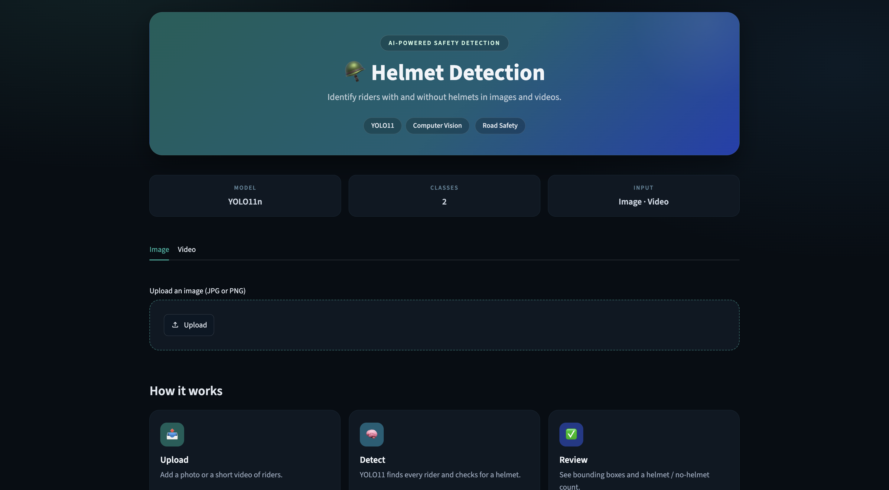

# 🪖 Helmet Detection (YOLO11)

Detects whether riders are wearing helmets in images and videos, using a custom-trained YOLO11n model and a Streamlit web app.

**Live demo:** <deploy ke baad apna Streamlit link yahan daalo>



## Features
- Image upload with instant detection
- Video upload (first 10 seconds are processed) with annotated output
- Green box for **helmet**, red box for **no helmet**
- Per-image counts and a quick safety summary
- Built-in example image and video to try without uploading anything

## Results
Evaluated on the validation set (372 images, 660 instances).

| Class | Precision | Recall | mAP50 |
|-------|-----------|--------|-------|
| **All** | **85.5%** | **88.3%** | **92.5%** |
| With Helmet | 88.2% | 94.1% | 96.0% |
| Without Helmet | 82.9% | 82.6% | 89.0% |

The model is strongest on the helmet class. The no-helmet class is harder, so some cases (small, blurred or partly hidden heads) can be missed.

## Training
- Model: YOLO11n (Ultralytics), pretrained weights
- Epochs: 40, image size 640, batch size 16
- Trained on Google Colab (T4 GPU)
- Full training and evaluation notebook: [`notebooks/helmet_training.ipynb`](notebooks/helmet_training.ipynb)

## Tech stack
Python, YOLO11 (Ultralytics), OpenCV, Streamlit, Pillow

## Project structure
```
helmet-detection/
├── app.py                  # Streamlit app (image and video inference)
├── best.pt                 # Trained model weights
├── requirements.txt
├── .streamlit/config.toml  # Theme and upload limit
├── examples/               # Example image and video
└── notebooks/
    └── helmet_training.ipynb
```

## Run locally
```bash
git clone https://github.com/AnishaSinha01/helmet-detection.git
cd helmet-detection
python -m venv venv
source venv/bin/activate
pip install -r requirements.txt
streamlit run app.py
```

## Dataset
Roboflow helmet dataset with two classes: With Helmet and Without Helmet.

## Limitations
- Videos are limited to the first 10 seconds and 50 MB to keep the demo fast on a free CPU server.
- Accuracy can drop in low light, heavy occlusion or very small faces.

## Author
**Anisha Sinha**
[GitHub](https://github.com/AnishaSinha01) · [LinkedIn](https://www.linkedin.com/in/anisha-sinha-3abb84326/)
